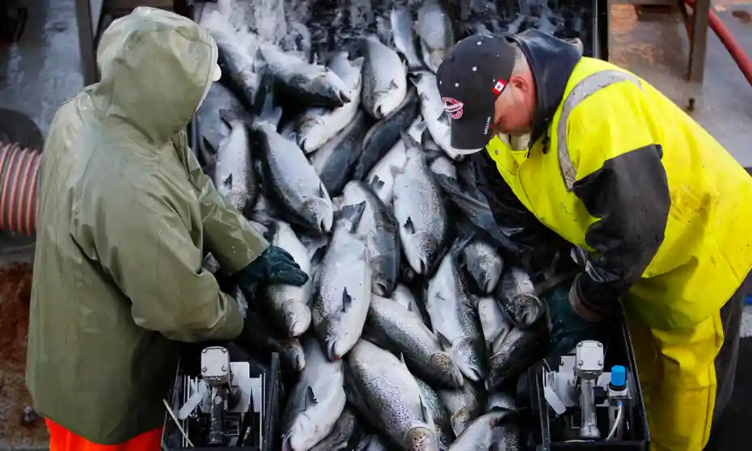

```{r setup, include=FALSE}
knitr::opts_chunk$set()
```

<br>

<b> <font size="+2"> Introduction </font> </u> </b>

<br>

<font size="+.5">

Atlantic Salmon <i> (Salmo salar) </i> are essential to a thriving ocean ecosystem as well as to the booming fish economy. Once widely distributed, the rise of climate change, overfishing, and ocean pollution has been linked with a decline in fish populations. Warming oceans lead to uninhabitable temperatures for salmon eggs to thrive which directly leads to a decrease in the number of successful salmon births. Of the salmon born, many will be fished to be sold in markets globally while many others will die from the bio-accumulation of plastics or other man made obstacles. Of the greater salmon population, only a relative select few will live to spawn more eggs for the cycle to continue.

In this report, I combed through the WWF's Living Planet Database to remark on the trends of global Atlantic salmon populations throughout time. This data is sourced from 20 different data sets on Atlantic Salmon populations from 1970 to 2010. I found that salmon populations have been constantly decreasing in this 40 year period with occasional intervals of even more rapid depopulation, notably in the late-1970s and the mid-1990s. From my analysis, I did find, however, that this trend seems to be slowing down and actually looks like salmon populations may start to increase across North America and Europe. Even though population are steadily coming out of this declining cycle, the reduction in salmon eggs, smolt, and adult populations still points to an increasing need for the WWF to begin instating programs to curb human's negative impacts on the and to help these populations bounce back even quicker.

</font>

<br>

```{r, echo=FALSE, out.width="50%", fig.cap= "Image: Overfishing is a leading global threat to Atlantic Salmon populations"}

```

-----

<b> <font size="+2"> Research Methods </font> </u> </b>

<br>

<font size="+.5">
As world news points out that overfishing, climate change, and ocean pollution are on the rise, I cannot help but think of their direct impact on salmon populations throughout their entire life cycle. For this reason, I wanted to see how these changes in environment effected Atlantic Salmon population from 1970 to 2010. By conducting a meta analysis of 20 studies, I was able to address <i> <b> how combined Atlantic Salmon populations of eggs, smolts, and adults have changed over the 40 year period between 1970 to 2010. </i> </b>

I used Atlantic Salmon population data provided by the WWF in the Living Planet Index Database. These sources may be found here and also using the code below: <i> https://docs.google.com/spreadsheets/d/1rkvBn87uJAhr_5cAlhm2fEgUYZiVENVBUYb3GeLhrQE/edit?usp=sharing</i>. 

```{r, echo = FALSE, warning = FALSE, message = FALSE}
library(tidyverse)           # Data wrangling
library(lme4)                # To create the mixed effects models
library(ggthemes)            # Extra themes, geoms and scales for ggplot2
library(gridExtra)           # Plot arrangement
library(ggeffects)           # Prediction functions
library(sjPlot)              # Visualizing random effects

load("~/Desktop/EDS (Environmental Data Science) Course/challenge3-mzargari/Data/LPI_species.Rdata")
```

```{r, results='hide'}
atlsal <- filter(LPI_species, Species == "Salmo salar") # only get Atlantic salmon species
unique(atlsal$Data.source.citation) # outputs all 20 sources of our data
```

<br>

This data spanned 40 years from 1970 to 2010. These different studies used various sampling methods and units while measuring Atlantic salmon populations throughout all stages of life. For this reason, I decided to use a scaled version of the population data where I ran a model on the data provided without units being a major obstacle. I also found that all Atlantic Salmon populations are in a freshwater system, are native, are not aliens, are not invasive, and understandably all have the same class, order, and family. For this reason, I decided to remove these columns from the data as they are redundant.

```{r}
# Removing the Xs before the years
atlsal2 <- atlsal %>%
  mutate(year = parse_number(as.character(year))) %>% 
  dplyr::select(-c(Class, Order, Family, system, Native, Alien, Invasive)) 
```

```{r, echo = FALSE}
# Defining variables that we will be using for this analysis for easier access
year <- atlsal2$year
scalepop <- atlsal2$scalepop
pop <- atlsal2$pop
id <- atlsal2$id
country <- atlsal2$Country.list
```

<br>

I made my predictions and analysis by using a Frequentest modelling framework to find any declining trends in salmon populations. I first created a simple model that only analyzed the relationship between the scaled populations and the year. I incorporated year into my model as a fixed effect in order to gauge the change in my scaled populations overtime. 

```{r}
model <- lm(scalepop ~ I(year - 1970)) # Fixed factor is "year"
```

<br>

However, I decided to add country, study ID, and the years into account as random effects since I believe that we need to take the location of the species and the differences in study formats into account as contributing to the model as well. This model differs from what I submitted in my preregistration since before I started my project, I believed that sampling method and country were sufficient to take into account as random effects. However, I found a greater random effect impact after taking year and study_id in account since I found that sampling method was not as descriptive to take into account as a random effect.

```{r}
modelRE <- lmer(scalepop ~ I(year - 1970) + (1|country) + (1|year) + (1|id))
```

</font>

-----

<b> <font size="+2"> Analysis </font> </u> </b>

<br>

<font size="+.5">

Afterwards, I compared their Akaike Information Criterion (AIC) and found that my random effects model is much better suited to go forward with as it has a smaller AIC.
```{r}
AIC(model)    
AIC(modelRE)

# Positive number >2 means that the mixed effects model is a better fit 
# The smaller Akaike Information Criterion (AIC) number the better
AIC(model) - AIC(modelRE)
```

<br>

I then graphed our scaled population to see its distribution and I checked on the residuals from our model using a residuals vs fit plot. I found that they appear to be well-fitted so we are safe to move on. For a thorough analysis, I also checked our qqplot and I found that most points form into a straight line.

```{r, echo = FALSE}
hist(scalepop, col = terrain.colors(4))
```

Figure 1. Histogram of scaled salmon populations of eggs, smolts, and adults.

<br>

```{r, echo = FALSE}
# Residuals are well behaved so we can assume that the relationship is linear

plot(modelRE, col="dark orange") 
```

Figure 2. Residual vs Fit plot. Residuals are well behaved so we can assume that the relationship is linear.

<br>

```{r, echo = FALSE}
qqnorm(residuals(modelRE), col="dark red")  # is normally distributed
qqline(residuals(modelRE), col="black")
```

Figure 3. QQplot

</font>

-----

<b> <font size="+2"> Results and Conclusions </font> </u> </b>

<br>

<font size="+.5">

I proceeded to make a prediction model to help visualize the Atlantic Salmon population trends.

```{r, results = 'hide'}
model_predictions <- ggpredict(modelRE, terms = c("year", "country"), type= "re") 
```

<br>

I found that no one part of the world has any major increase or decrease in population, however, there is a decline in populations in the 1990s and early 2000s throughout the world.

```{r, echo = FALSE}
(ggplot(model_predictions) + 
   # plots year on x axis and scalepop on y axis with each data point colored by country
   geom_point(data = atlsal2,
              aes(x = year, y = scalepop, colour = country)) +
   labs(x = "Year", y = "Scaled Population", 
        title = "Atlantic Salmon Populations by Country") + 
   theme_minimal()
)
```


Figure 4. Scaled populations throughout North America and Europe between 1970 and 2010

<br>

I then plotted our predictions to model our data by country in these 40 years. We can see that populations start declining at a slower rate starting around 1995. The Endangered Species Act of 2000 also causes Atlantic Salmon populations to not decline as rapidly. In Finland and Canada, their populations actually started increasing and noted by Figure 5.

```{r, echo = FALSE}
(ggplot(atlsal2, aes(x = year, y = scalepop, colour = country)) + 
    facet_wrap(~ biome, ncol = 2) +  # plots biomes in a grid with 2 graphs per row
    geom_point(alpha = 0.3) +               # size of dots
    theme_classic() +
    # adds a predicted line from our mixed model 
    geom_line(data = cbind(atlsal2, pred = predict(modelRE)), aes(y = pred), size = 1) +   
    theme(legend.position = "bottom",
         panel.spacing = unit(1, "lines"),  # adding space between panels
         axis.text.x = element_text(angle = 45, hjust = 1)))
```

Figure 5. Graphs indicate a slowing down of Atlantic salmon population decline across both biomes and all countries, notably Finland, Norway, and Canada.

<br>

I also found population trends in Europe and North America respectively over this 40 year span. We can see that my model predicts that both region's populations are very slowly coming out of their decline. An interesting trend to note is that we see very similar predictions in Europe and North America across both polar freshwaters and temperate coastal rivers. When one population in one region decreases more rapidly or more slowly, the same effect is felt in the counterpart region as well.

```{r, echo = FALSE}
(ggplot(atlsal2, aes(x = year, y = scalepop, colour = biome)) + 
    facet_wrap(~ Region, ncol = 2) +        # plots both regions in a grid with 2 graphs per row
    geom_point(alpha = 0.3) +               # size of dots
    theme_classic() +
    # adds a predicted line from our mixed model 
    geom_line(data = cbind(atlsal2, pred = predict(modelRE)), aes(y = pred), size = 1) +   
    theme(legend.position = "bottom",
          panel.spacing = unit(1, "lines"), # adding space between panels
          axis.text.x = element_text(angle = 45, hjust = 1)))
```

Figure 6. Graphs show a steady decrease in Atlantic Salmon population dwindling in both North America and Europe with similar population trends across both biomes in the polar freshwaters and the temperate coastal rivers.

<br>

In conclusion, Atlantic Salmon populations have come a long way since the 1970s. While many populations are still declining, even in 2010, our data points to the fact that Atlantic Salmon are doing better than they were 40 years ago. Our efforts with legislation such as the Endangered Species Act and even consumer habits such as labeling fish endangerment levels at the supermarkets (i.e. Whole Foods in the United States) seems to be helping with their population growths. 

As a global collective, I would not recommend removing Atlantic Salmon from their endangered status as our trends indicate that even though their populations may begin to increase, they are increasing at a very slow rate. With constant habitat loss and rising ocean temperatures these trends can change at any time. I would recommend that the WWF step in to continue to fight against overfishing and to spread awareness on the species, as it is our duty to disincentive individuals and countries from polluting rivers and oceans and contributing to global climate change. Together, we can all help to allow wildlife populations an opportunity to bounce back.

</font>

----

<br>